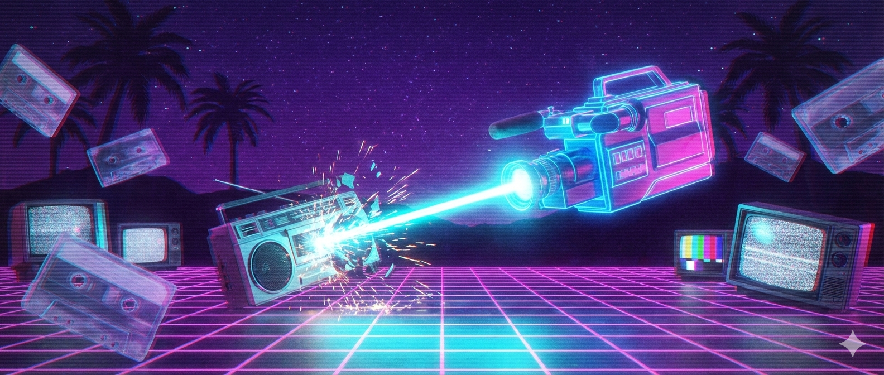

# radiostar-killer

<p align="center">
  
</p>

Generate music videos by syncing video clips to audio beats. Point it at a folder of video clips and an audio file, and it'll analyze the beat structure, chop and assign clips to beat groups, and export a beat-synced MP4.

## Install

Requires [uv](https://docs.astral.sh/uv/) and Python 3.12+.

```bash
git clone https://github.com/mcfredrick/radiostar-killer.git
cd radiostar-killer
uv sync
```

## Usage

```bash
radiostar-killer <clips_dir> <audio_file> [options]
```

### Example

```bash
uv run radiostar-killer ./my-clips ./song.wav -o music-video.mp4 --seed 42
```

### Options

| Flag | Default | Description |
|------|---------|-------------|
| `-o`, `--output` | `output.mp4` | Output file path |
| `--min-beats` | `2` | Minimum beats per group |
| `--seed` | random | Seed for reproducible clip ordering and trimming |
| `--resolution` | from preset | Output resolution (`WIDTHxHEIGHT`), overrides the format preset |
| `--fps` | from preset | Output frames per second, overrides the format preset |
| `--format` | `youtube` | Output format preset (see [Format Presets](#format-presets)) |
| `--shorts` | off | Generate 3 YouTube Shorts from the most energetic sections |
| `--short-duration` | `60` | Duration in seconds for each short |
| `--effects` | off | Apply random visual effects to clips |
| `--effect-rate` | `0.75` | Proportion of clips to apply effects to (0.0–1.0) |
| `--transitions` | off | Apply transition effects between clips |
| `--transition-rate` | `1.0` | Proportion of clip boundaries with transitions (0.0–1.0) |
| `--transition-duration` | `0.3` | Transition overlap in seconds |
| `--split-screen` | off | Inject split screen moments (2, 4, or 6 clips) |
| `--split-screen-count` | `2` | Number of split screen occurrences to inject (max recommended: 3) |
| `--split-screen-panels` | random | Fixed panel count per split screen (`2`, `4`, or `6`); omit for random per occurrence |
| `--climax-burst` | off | Inject a 2→4→6→4→2 panel burst at the song's peak energy moment |
| `--randomize` | off | Randomly enable visual flags (see [Randomize](#randomize)) |
| `--title` | — | Song title (required for `--title-card` and `--info-overlay`) |
| `--artist` | — | Artist name (required for `--info-overlay`) |
| `--album` | — | Album name (optional, shown in info overlay) |
| `--title-card` | off | Add an opening title card |
| `--title-card-duration` | `3.5` | Title card duration in seconds (snapped to nearest beat) |
| `--info-overlay` | off | Add an MTV/VH1-style song info overlay |
| `--info-overlay-duration` | `8.0` | Info overlay display duration in seconds |
| `--fast` | off | Use ultrafast encoding and max threads for quicker export (lower quality) |

### Format Presets

Use `--format` to target a specific platform. Each preset configures resolution, FPS, and encoding settings so the output is ready to upload without re-encoding.

| Preset | Resolution | Orientation | Bitrate | Notes |
|--------|-----------|-------------|---------|-------|
| `youtube` | 1920x1080 | Landscape (16:9) | default | Default preset |
| `youtube-shorts` | 1080x1920 | Portrait (9:16) | default | Max 180s |
| `tiktok` | 1080x1920 | Portrait (9:16) | 12M video, 256k audio | |
| `instagram-reels` | 1080x1920 | Portrait (9:16) | 3500k video, 128k audio | |

```bash
# Export for TikTok
uv run radiostar-killer ./clips ./song.wav -o tiktok_video.mp4 --format tiktok

# Export for Instagram Reels
uv run radiostar-killer ./clips ./song.wav -o reel.mp4 --format instagram-reels

# Override a preset's resolution (e.g. 720p YouTube)
uv run radiostar-killer ./clips ./song.wav --format youtube --resolution 1280x720
```

### YouTube Shorts Generation

Use `--shorts` to automatically generate up to 3 short videos from the most energetic parts of the song. The CLI analyzes RMS energy across the audio and picks the top non-overlapping high-energy sections.

```bash
# Generate 3 x 60-second shorts (default)
uv run radiostar-killer ./clips ./song.wav --shorts

# Generate 3 x 45-second shorts
uv run radiostar-killer ./clips ./song.wav --shorts --short-duration 45

# Shorts with a specific output stem (produces output_short_1.mp4, output_short_2.mp4, ...)
uv run radiostar-killer ./clips ./song.wav --shorts -o output.mp4
```

When `--shorts` is used:
- The format defaults to `youtube-shorts` (1080x1920 portrait) unless overridden with `--format`
- No full-length video is generated — only the shorts
- Output files are named `{stem}_short_1.mp4`, `{stem}_short_2.mp4`, `{stem}_short_3.mp4`
- If the audio is too short to produce 3 non-overlapping sections, fewer shorts are generated

### Effects and Transitions

Use `--effects` to apply random visual effects (gamma correction, brightness, contrast, black & white, color inversion, mirroring, painting style, zoom, blur, color tinting) to individual clips. Use `--transitions` to add smooth transitions (crossfade, slide in from any direction) between clips instead of hard cuts.

```bash
# Apply effects to ~75% of clips and transitions at every cut
uv run radiostar-killer ./clips ./song.wav --effects --transitions

# Effects on all clips, transitions on half the boundaries
uv run radiostar-killer ./clips ./song.wav --effects --effect-rate 1.0 --transitions --transition-rate 0.5

# Longer crossfade transitions (0.5s overlap)
uv run radiostar-killer ./clips ./song.wav --transitions --transition-duration 0.5

# Reproducible with seed
uv run radiostar-killer ./clips ./song.wav --effects --transitions --seed 42
```

Both flags combine with `--seed` for reproducible output. Effects and transitions work with all format presets and with `--shorts`.

### Title Card and Info Overlay

Add a full-screen opening title card and/or an MTV/VH1-style song info overlay in the bottom-left corner. Music plays during the title card (standard music video convention). The title card duration is automatically snapped to the nearest beat for a clean transition.

```bash
# Title card only
uv run radiostar-killer ./clips ./song.wav --title "Video Killed the Radio Star" --artist "The Buggles" --title-card

# Info overlay only
uv run radiostar-killer ./clips ./song.wav --title "Video Killed the Radio Star" --artist "The Buggles" --info-overlay

# Both with album info
uv run radiostar-killer ./clips ./song.wav \
  --title "Video Killed the Radio Star" \
  --artist "The Buggles" \
  --album "The Age of Plastic" \
  --title-card --info-overlay

# Custom durations
uv run radiostar-killer ./clips ./song.wav \
  --title "My Song" --artist "My Band" \
  --title-card --title-card-duration 5.0 \
  --info-overlay --info-overlay-duration 10.0
```

Both features work with all format presets, `--shorts`, effects, and transitions.

### Split Screen and Climax Burst

Use `--split-screen` to randomly inject moments where 2, 4, or 6 clips play simultaneously in a grid. Use `--climax-burst` to inject a dramatic 2→4→6→4→2 panel sequence at the song's peak energy moment.

```bash
# Random split screens (2 occurrences, random panel count)
uv run radiostar-killer ./clips ./song.wav --split-screen

# 3 occurrences, always 4 panels
uv run radiostar-killer ./clips ./song.wav --split-screen --split-screen-count 3 --split-screen-panels 4

# Climax burst only
uv run radiostar-killer ./clips ./song.wav --climax-burst

# Both together
uv run radiostar-killer ./clips ./song.wav --split-screen --climax-burst
```

### Randomize

Use `--randomize` to let the tool randomly enable visual features (`--effects`, `--transitions`, `--split-screen`, `--climax-burst`) and their tuning parameters. Any flags you pass explicitly are respected — only unset flags are randomized.

Before processing starts, the tool prints which features were enabled and a fully-specified command you can copy-paste to reproduce the same output.

```bash
# Fully randomized
uv run radiostar-killer ./clips ./song.wav --randomize

# Lock in effects, randomize everything else
uv run radiostar-killer ./clips ./song.wav --randomize --effects

# Example output:
# [randomize] Enabled: --effects, --transitions, --climax-burst
# [randomize] Reproduce with:
#   radiostar-killer ./clips ./song.wav -o output.mp4 --effects --effect-rate 0.65 --transitions --transition-rate 0.82 --transition-duration 0.34 --climax-burst
```

## How it works

1. **Beat detection** — Uses [librosa](https://librosa.org/) to analyze the audio file, detect tempo, and extract beat timestamps.
2. **Beat grouping** — Partitions beats into groups of 4. Remainders smaller than `--min-beats` get merged into the previous group.
3. **Clip assignment** — Discovers video files (`.mp4`, `.mov`, `.avi`) in the clips directory, shuffles them, and assigns to beat groups via round-robin. Clips are recycled if there are fewer clips than groups.
4. **Video assembly** — Each clip is trimmed (from a random point) or looped to match its beat group duration, resized to the target resolution, then concatenated. The original audio is overlaid and the final video is exported with H.264/AAC via [moviepy](https://zulko.github.io/moviepy/).

## Development

```bash
# Run tests
uv run pytest

# Run linting
uv run ruff check src/ tests/

# Type checking
uv run mypy src/
```
